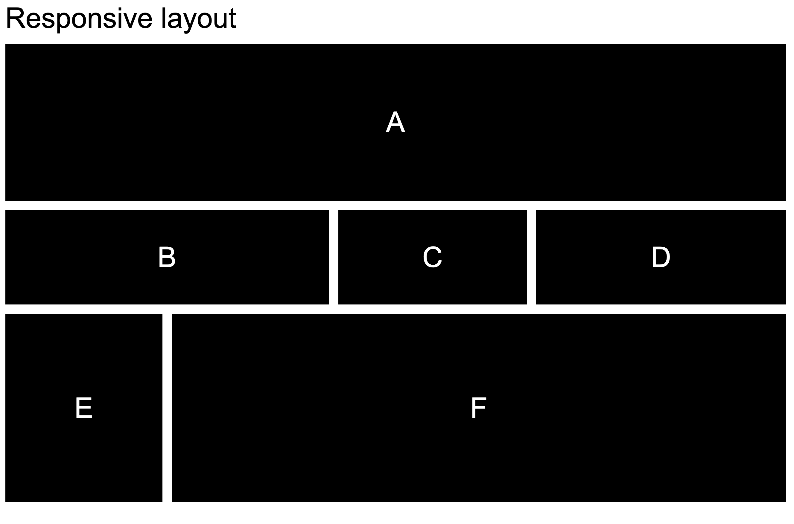
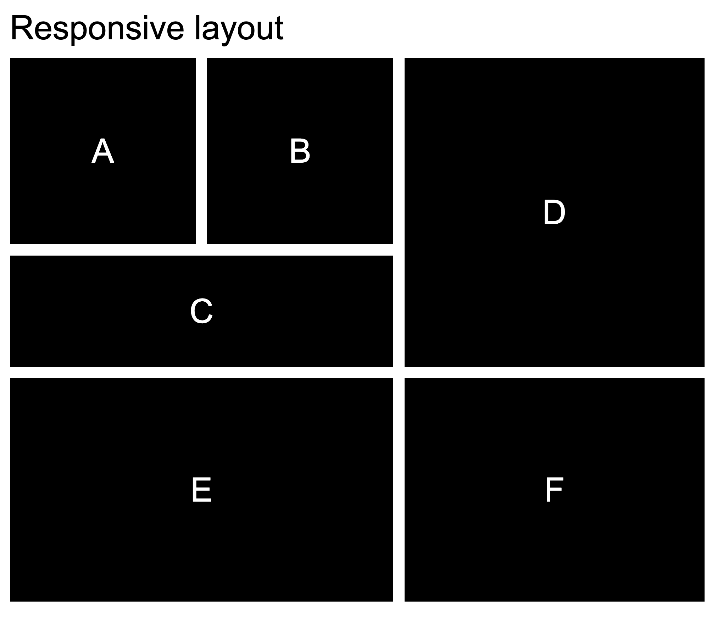
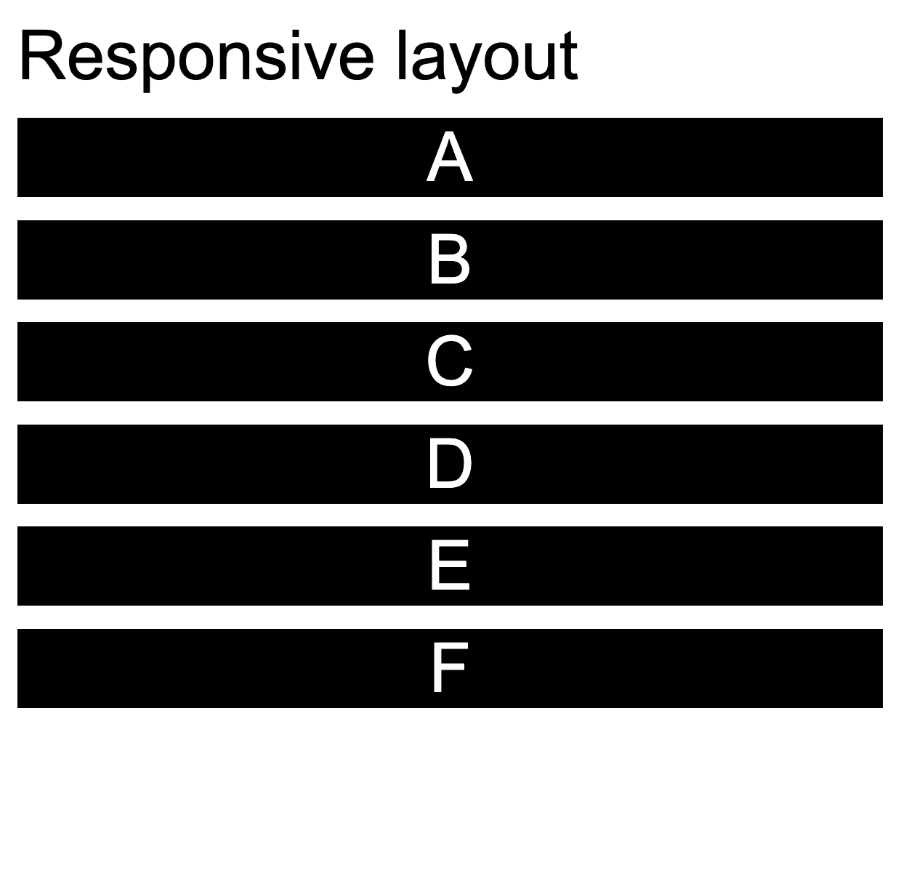

# Responsive Grid

## Responsive lay-out

> Tip: Deze oefening is gebaseerd op een examenvraag.

Je krijgt een HTML-bestand met een `<section class='part'>`-element met daarin zes `
`-elementen. Het is jouw taak om daarmee een responsive layout te bouwen naar volgend voorbeeld:

<figure>
  
  <figcaption>Het eindresultaat bij schermen groter dan 600px</figcaption>
</figure>

<figure>
  
  <figcaption>Het eindresultaat bij schermen tussen 500px en 600px</figcaption>
</figure>

<figure>
  
  <figcaption>Het eindresultaat bij schermen kleiner dan 501px</figcaption>
</figure>

### Break-points

In deze oefening maken we gebruik van 3 break-points:

* **Large screens**: schermbreedtes breder dan 600px.
* **Medium screens**: schermbreedtes tussen 500px en 600px
* **Small screens**: schermbreedtes smaller dan 500px

### Layout algoritmes

Bij small screens wordt gebruik gemaakt van flexbox voor layouting. Bij medium en large screens maken we gebruik van een CSS grid.

#### Grid configuratie

De parent zal zowel bij large als bij medium schermen **4 kolommen** en **3 rijen** bevatten:

  - De eerste en tweede kolom zijn elk 150px breed.
  - De derde kolom is 180px breed.
  - De vierde kolom neemt de rest van de ruimte in (1fr).
  - De eerste rij is 150px hoog.
  - De tweede rij is 90px hoog.
  - De derde rij is 180px hoog.
  
#### Grid-children

De gap tussen de grid-items is 1rem zowel horizontaal als verticaal.
Zet afhankelijk van de screen size de children in de volgende configuratie:

##### Large Screens

- De eerste rij bevat vier delen "A".
- De tweede rij bevat twee delen "B", een deel "C" en een deel "D".
- De derde rij bevat één deel "E" en drie delen "F".

##### Medium screens

- De eerste rij bevat een deel "A", een deel "B" en twee delen "D".
- De tweede rij bevat twee delen "C" en twee delen "D".
- De derde rij bevat twee delen "E" en twee delen "F".

#### Small screens

Bij small screens moet het grid aangepast worden naar flexbox. 
Zorg dat alle children onder elkaar komen.  De gap tussen de flex-items is 1rem.

### Requirements

* Ga **mobile first** te werk.
* Bij large en medium screens maak je gebruik de gegeven `grid-area` namen. 
* Zorg er voor dat je geen code dupliceert binnen media-queries. Pas enkel aan enkel wat je nodig hebt.